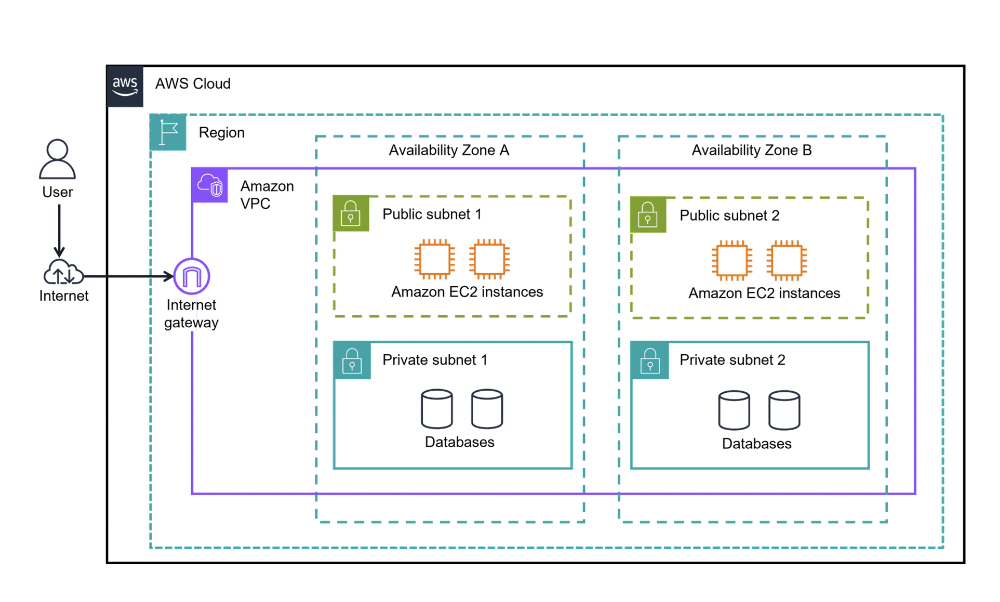

# Networking

networking concept called Amazon Virtual Private Cloud, or VPC. VPCs help you provision a logically isolated section of the AWS Cloud.More importantly, these resources can be public or private. Public-facing resources have access to the internet, whereas private resources do not have internet access.

Subnets are used to organize your resources and can be made publicly or privately accessible. A private subnet is commonly used to contain resources like a database storing customer or transactional information. A public subnet is commonly used for resources like a customer-facing website.

Internt gateway is like door to public : its like main door to coffe shop

When you want all private then instead of IG you install Virtual private Gateway which will allow only private traffic (approved network , may be using VPN)

### AWS Direct Connect
When we use VPN to access private resources , still it will go throught all process of networking.its like 
the coffee shop in the private corporate office building is that this office building is shared by multiple companies, and there are a lot of people who work here. Even though I have special access to the coffee shop, I still might have to wait for the elevator, navigate crowded hallways, or stand in line.
This is similar to how a VPN works.While it provides a secure connection, it still routes your traffic through a shared network, which can sometimes lead to slowdowns, especially when many people are using it at the same time.

Direct Connect lets you establish a completely private, dedicated fiber connection from your data center to AWS. It ensures both security and consistent high performance. You work with a Direct Connect partner in your area to establish this connection because, like my magic doorway, Direct Connect provides a physical line that connects your network to your Amazon VPC. This can help you meet regulatory and compliance needs, as well as sidestep any potential bandwidth issues.

### Connecting with AWS Cloud

There are four ways to connect to the AWS Cloud:

1. AWS Client VPN (networking service you can use to connect your remote workers and on-premises networks to the cloud.scales up and down automatically)
2. AWS Site-to-Site VPN (creates a secure connection between your data center or branch offices and your AWS Cloud resources.)
3. AWS PrivateLink
    - use to privately connect your VPC to services and resources as if they were in your VPC. You do not need to use an internet gateway, NAT device, public IP address, Direct Connect connection, or AWS Site-to-Site VPN connection to allow communication with AWS services or resources from your private subnets. Instead, you control the specific API endpoints, sites, services, and resources that are reachable from your VPC.
    - Use case: It is used for connecting your clients in your VPC to resources, other VPCs, and endpoints.
4. AWS Direct Connect

## Other Gateways
- AWS Transit Gateway
- Network Address Translation (NAT) Gateway
- Amazon API Gateway

# Network Security

One of the main reasons to use subnets in a VPC is to control access to the gateways. The public subnets have access to the internet gateway, the private subnets do not. But subnets can also control traffic permissions.
Packets are messages from the internet, and every packet that crosses the subnet boundaries gets checked against something called a **network access control list**, or network ACL. This check is to see if the packet has permissions to either leave or enter the subnet, based on who it was sent from and how it's trying to communicate.

